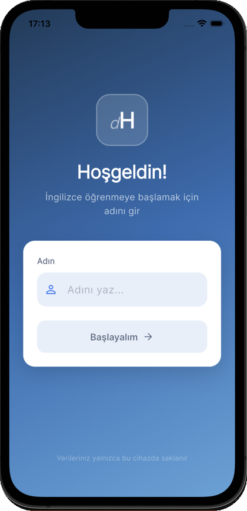
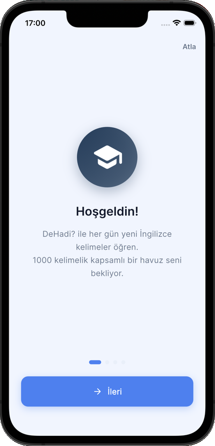
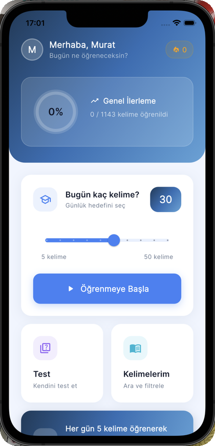
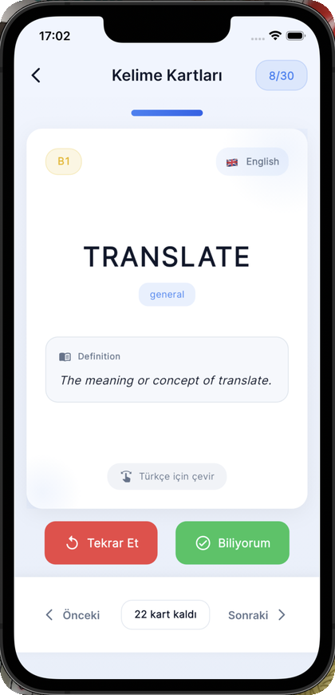
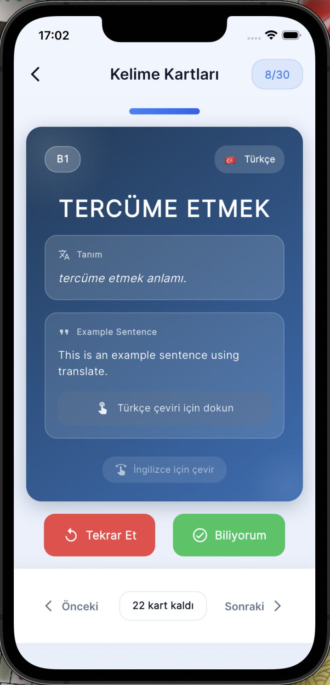
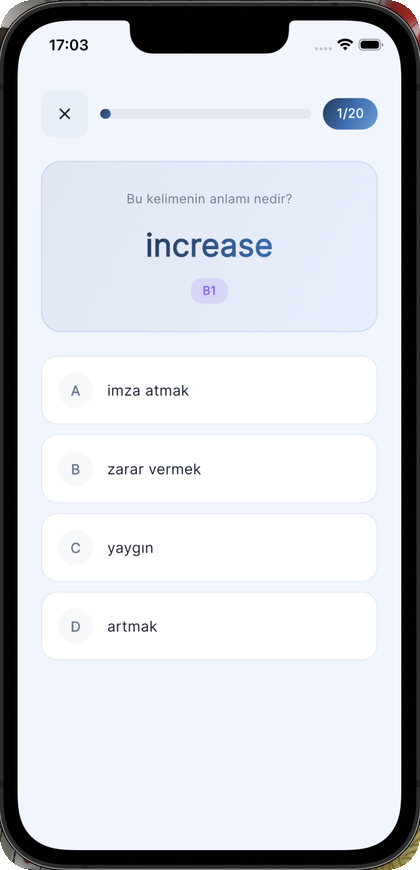
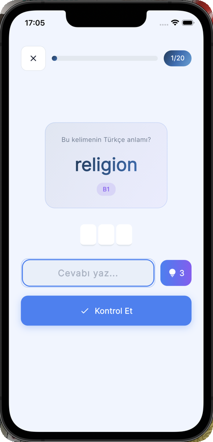
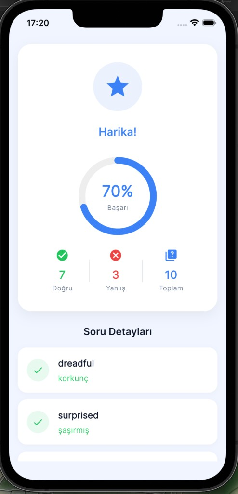
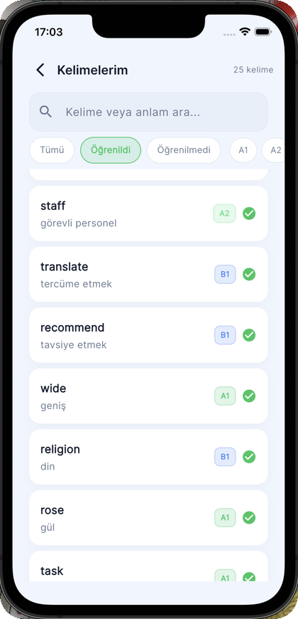
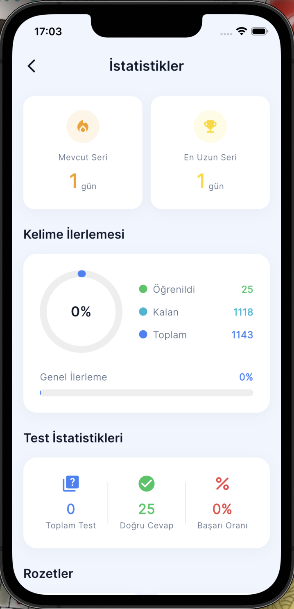

<h1 align="center">
  <br>
  DeHadi — İngilizce Kelime Öğrenme Uygulaması
  <br>
</h1>

<p align="center">
  
  
  
  
</p>

<p align="center">
  Bilimsel aralıklı tekrar algoritması ile İngilizce kelime öğrenmeyi kalıcı ve eğlenceli hale getiren cross-platform mobil uygulama.
</p>

---

## 📸 Ekran Görüntüleri

<p align="center">
  
  
  
  
  
</p>

<p align="center">
  
  
  
  
  
</p>

---

## ✨ Özellikler

### 🧠 Akıllı Öğrenme Sistemi
- **Aralıklı Tekrar (Spaced Repetition)** — Bilimsel algoritmaya dayalı tekrar sistemi; doğru bildiğin kelimeleri seyrek, yanlış bildiklerini sık göstererek kalıcı öğrenmeyi sağlar
- **997 Kelime Hazinesi** — CEFR standartlarında A1'den C2'ye kadar sınıflandırılmış kapsamlı kelime veritabanı
- **Günlük Dozaj Kontrolü** — Bilişsel yükü optimize etmek için günde 5–50 kelime arasında kişiselleştirilebilir çalışma miktarı

### 🃏 Kelime Kartları
- **Flip Card Arayüzü** — Ön yüzde İngilizce kelime, arka yüzde Türkçe karşılığı, İngilizce tanım ve örnek cümle
- **Akıcı Animasyonlar** — Her kart geçişinde göz yormayan, modern animasyonlar

### 🎯 Çoklu Test Modları
- **Çoktan Seçmeli Test** — 4 seçenekli klasik quiz formatı
- **Yazarak Cevaplama** — Hangman (adam asmaca) stiliyle harf harf tahmin; joker desteği mevcut
- **Eşleştirme Oyunu** — Kelime-anlam çiftlerini drag & match yöntemiyle eşleştir

### 📊 İlerleme & Motivasyon
- **Seri Takibi (Streak)** — Günlük çalışma zincirinizi kırmadan devam etmenizi teşvik eden streak sistemi
- **Detaylı İstatistikler** — Doğruluk oranı, öğrenilen kelime sayısı, seviye bazlı ilerleme grafikleri ve başarı rozetleri
- **Kelime Kütüphanesi** — Tüm kelimeleri arayın, seviyeye göre filtreleyin, detaylarını inceleyin

### 🎨 Kullanıcı Deneyimi
- **Karanlık / Aydınlık Tema** — Göz dostu tam karanlık mod desteği
- **Günlük Bildirimler** — "Günün kelimeleri hazır!" hatırlatıcıları ile düzenli çalışma alışkanlığı
- **Kullanıcı Profili** — İsim girişi, seviye seçimi ve kişisel ilerleme yönetimi

---

## 🚀 Kurulum

### Ön Gereksinimler

| Araç | Minimum Versiyon |
|------|-----------------|
| Flutter SDK | 3.10+ |
| Dart SDK | 3.10+ |
| Xcode | 14+ *(iOS için)* |
| Android Studio | Electric Eel+ *(Android için)* |

### 1. Projeyi İndir

```bash
git clone https://github.com/muratemiz/dehadi-flutter-app.git
cd dehadi-flutter-app
```

### 2. Bağımlılıkları Yükle

```bash
flutter pub get
```

### 3. Kod Üretimini Çalıştır

```bash
dart run build_runner build
```

### 4. Uygulamayı Başlat

```bash
# Bağlı cihazda çalıştır (Android veya iOS)
flutter run

# Android APK oluştur
flutter build apk --release

# iOS build
flutter build ios --release
```

---

## 🗂️ Proje Yapısı

```
lib/
│
├── 📄 main.dart                          # Uygulama giriş noktası
├── 📄 uygulama.dart                      # Ana widget & route tanımları
│
├── 🔧 cekirdek/
│   ├── sabitler/
│   │   └── uygulama_renkleri.dart        # Renk paleti
│   ├── tema/
│   │   └── uygulama_temasi.dart          # ThemeData tanımları
│   └── araclar/
│       ├── hata_yonetimi.dart            # Global hata yakalama
│       ├── bildirim_yoneticisi.dart      # Bildirim yönetimi
│       └── aralikli_tekrar.dart          # Spaced Repetition algoritması
│
├── 🗄️ veri/
│   ├── modeller/
│   │   ├── kelime_modeli.dart            # Kelime veri modeli (Hive)
│   │   └── kullanici_ilerlemesi.dart     # İlerleme & seri modeli (Hive)
│   ├── depolar/
│   │   └── kelime_deposu.dart            # Veri erişim katmanı (Singleton)
│   └── kelimeler/
│       └── kelime_verileri.dart          # 997 kelimelik JSON veri kaynağı
│
├── ⚙️ saglayicilar/
│   ├── kelime_saglayici.dart             # Kelime state yönetimi
│   ├── test_saglayici.dart               # Test state yönetimi
│   ├── seri_saglayici.dart               # Streak state yönetimi
│   └── tema_saglayici.dart              # Tema state yönetimi
│
├── 🧩 bilesenler/
│   ├── cevir_kart.dart                   # Flip card widget
│   ├── gezinti_cubugu.dart               # Alt navigasyon çubuğu
│   ├── seri_rozeti.dart                  # Streak badge widget
│   └── ilerleme_gostergesi.dart          # İlerleme göstergeleri
│
└── 📱 ekranlar/
    ├── acilis/                           # Splash screen
    ├── giris/                            # Kullanıcı giriş ekranı
    ├── onboarding/                       # Onboarding akışı
    ├── ana_sayfa/                        # Dashboard & profil
    ├── kartlar/                          # Kelime kartları ekranı
    ├── test/
    │   ├── test_secim_ekrani.dart        # Test türü seçimi
    │   ├── test_ekrani.dart              # Çoktan seçmeli
    │   ├── yazarak_test_ekrani.dart      # Yazarak cevaplama
    │   ├── eslestirme_ekrani.dart        # Eşleştirme oyunu
    │   └── test_sonuc_ekrani.dart        # Sonuç & özet
    ├── kelime_listesi/                   # Kelime kütüphanesi
    └── istatistik/                       # İstatistik & rozetler
```

---

## 🛠️ Kullanılan Teknolojiler

| Paket | Kullanım Amacı |
|-------|----------------|
| [provider](https://pub.dev/packages/provider) | State management |
| [hive](https://pub.dev/packages/hive) + [hive_flutter](https://pub.dev/packages/hive_flutter) | Yerel NoSQL veritabanı |
| [flutter_animate](https://pub.dev/packages/flutter_animate) | Akıcı animasyonlar |
| [flip_card](https://pub.dev/packages/flip_card) | Kelime kartı çevirme efekti |
| [google_fonts](https://pub.dev/packages/google_fonts) | Tipografi |
| [flutter_local_notifications](https://pub.dev/packages/flutter_local_notifications) | Günlük hatırlatma bildirimleri |
| [percent_indicator](https://pub.dev/packages/percent_indicator) | İlerleme göstergeleri |

---

## 📄 Lisans

Bu proje kişisel kullanım amaçlıdır. © 2026 DeHadi
