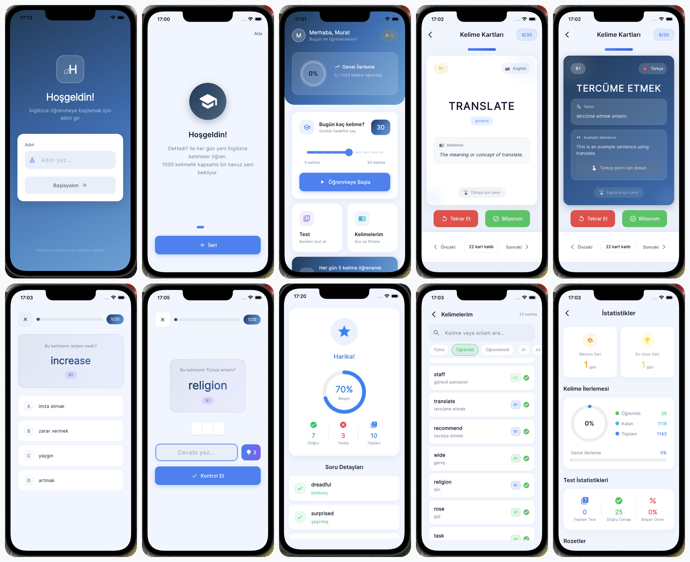

<h1 align="center">DeHadi — İngilizce Kelime Öğrenme Uygulaması</h1>

<p align="center">
  
  
  
  
</p>

<p align="center">
  Bilimsel aralıklı tekrar algoritması ile İngilizce kelime öğrenmeyi kalıcı ve eğlenceli hale getiren cross-platform mobil uygulama.
</p>

---

## ✨ Özellikler

| | Özellik | Açıklama |
|--|---------|----------|
| 🧠 | **Aralıklı Tekrar** | Yanlış bildiğin kelimeleri sık, doğru bildiğini seyrek göstererek kalıcı öğrenme |
| 📚 | **997 Kelime** | A1–C2 CEFR seviyelerine göre sınıflandırılmış kapsamlı kelime havuzu |
| 🃏 | **Flip Kartlar** | Ön yüz İngilizce, arka yüz Türkçe karşılık + tanım + örnek cümle |
| 🎯 | **3 Test Modu** | Çoktan seçmeli · Yazarak cevaplama (hangman) · Eşleştirme oyunu |
| 🔥 | **Streak Takibi** | Günlük çalışma serisi ve motivasyon sistemi |
| 📊 | **İstatistikler** | Doğruluk oranı, ilerleme grafikleri ve başarı rozetleri |
| 🔍 | **Kelime Kütüphanesi** | Tüm kelimeleri ara, seviyeye göre filtrele |
| 🌙 | **Karanlık Mod** | Tam karanlık tema desteği |
| 🔔 | **Günlük Bildirim** | Her gün hatırlatıcı ile düzenli çalışma alışkanlığı |

---

## 📸 Ekran Görüntüleri

<p align="center">
  
</p>

---

## 🚀 Kurulum

### 1. Projeyi İndir

```bash
git clone https://github.com/muratemiz/dehadi-flutter-app.git
cd dehadi-flutter-app
```

### 2. Bağımlılıkları Yükle & Çalıştır

```bash
flutter pub get
dart run build_runner build
flutter run
```

### 3. Build Al

```bash
# Android
flutter build apk --release

# iOS
flutter build ios --release
```

> **Gereksinimler:** Flutter 3.10+ · Dart 3.10+ · Xcode 14+ *(iOS)* · Android Studio *(Android)*

---

## 🗂️ Proje Yapısı

```
lib/
│
├── 📄 main.dart                          # Uygulama giriş noktası
├── 📄 uygulama.dart                      # Ana uygulama widget'ı ve route tanımları
│
├── 🔧 cekirdek/
│   ├── sabitler/
│   │   └── uygulama_renkleri.dart        # Renk paleti (Fasih teması)
│   ├── tema/
│   │   └── uygulama_temasi.dart          # ThemeData tanımları
│   └── araclar/
│       ├── hata_yonetimi.dart            # Global hata yakalama
│       ├── bildirim_yoneticisi.dart      # Bildirim yönetimi
│       └── aralikli_tekrar.dart          # Spaced Repetition algoritması
│
├── 🗄️ veri/
│   ├── modeller/
│   │   ├── kelime_modeli.dart            # Kelime veri modeli (Hive)
│   │   └── kullanici_ilerlemesi.dart     # İlerleme & seri modeli (Hive)
│   ├── depolar/
│   │   └── kelime_deposu.dart            # Veri erişim katmanı (Singleton)
│   └── kelimeler/
│       └── kelime_verileri.dart          # 997 kelimelik JSON veri kaynağı
│
├── ⚙️ saglayicilar/
│   ├── kelime_saglayici.dart             # Kelime state yönetimi
│   ├── test_saglayici.dart               # Test state yönetimi
│   ├── seri_saglayici.dart               # Streak state yönetimi
│   └── tema_saglayici.dart               # Tema state yönetimi
│
├── 🧩 bilesenler/
│   ├── cevir_kart.dart                   # Flip card widget
│   ├── gezinti_cubugu.dart               # Alt navigasyon çubuğu
│   ├── seri_rozeti.dart                  # Streak badge widget
│   └── ilerleme_gostergesi.dart          # İlerleme göstergeleri
│
└── 📱 ekranlar/
    ├── acilis/acilis_ekrani.dart         # Splash screen
    ├── giris/giris_ekrani.dart           # Kullanıcı giriş ekranı
    ├── onboarding/onboarding_ekrani.dart # Onboarding akışı
    ├── ana_sayfa/ana_ekran.dart          # Dashboard & profil
    ├── kartlar/kart_ekrani.dart          # Kelime kartları ekranı
    ├── test/
    │   ├── test_secim_ekrani.dart        # Test türü seçimi
    │   ├── test_ekrani.dart              # Çoktan seçmeli test
    │   ├── yazarak_test_ekrani.dart      # Yazarak cevaplama testi
    │   ├── eslestirme_ekrani.dart        # Eşleştirme oyunu
    │   └── test_sonuc_ekrani.dart        # Sonuç & özet ekranı
    ├── kelime_listesi/kelime_listesi_ekrani.dart
    └── istatistik/istatistik_ekrani.dart
```

---

## 🛠️ Teknolojiler

| Paket | Kullanım Amacı |
|-------|----------------|
| [provider](https://pub.dev/packages/provider) | State management |
| [hive](https://pub.dev/packages/hive) + [hive_flutter](https://pub.dev/packages/hive_flutter) | Yerel veritabanı |
| [flip_card](https://pub.dev/packages/flip_card) | Kart çevirme efekti |
| [flutter_animate](https://pub.dev/packages/flutter_animate) | Animasyonlar |
| [flutter_local_notifications](https://pub.dev/packages/flutter_local_notifications) | Günlük bildirimler |
| [google_fonts](https://pub.dev/packages/google_fonts) | Tipografi |
| [percent_indicator](https://pub.dev/packages/percent_indicator) | İlerleme göstergeleri |

---

## 📄 Lisans

Bu proje kişisel kullanım amaçlıdır. © 2026 DeHadi
